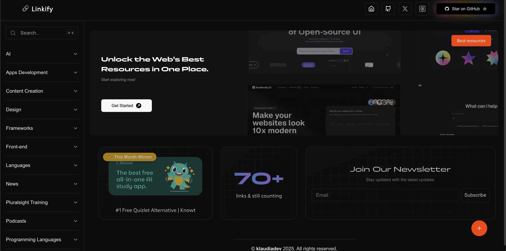

# Linkify

A modern, curated collection of useful links and resources for developers, designers, and tech enthusiasts. Built with Next.js 14, TypeScript, and Tailwind CSS.



## 🌟 Features

- 📚 Curated collections of resources across multiple categories
- 🔍 Fast, real-time search functionality
- 🎨 Beautiful, responsive UI with dark mode support
- 🏷️ Tag-based filtering system
- 🖼️ Rich previews for all links with metadata
- ⌨️ Keyboard shortcuts for quick navigation
- 📱 Mobile-friendly design

## 🚀 Tech Stack

- **Framework**: [Next.js](https://nextjs.org/)
- **Language**: [TypeScript](https://www.typescriptlang.org/)
- **Styling**: [Tailwind CSS](https://tailwindcss.com/)
- **UI Components**: 
  - [Radix UI](https://www.radix-ui.com/)
  - [Shadcn/ui](https://ui.shadcn.com/)
- **Metadata**: [RapidAPI Metafetch](https://rapidapi.com/metafetch)
- **Icons**: [Lucide Icons](https://lucide.dev/)

## 📦 Installation

1. Clone the repository:
   ```bash
   git clone https://github.com/yourusername/linkify.git
   cd linkify
   ```

2. Install dependencies:
   ```bash
   npm install
   # or
   yarn install
   # or
   pnpm install
   ```

3. Set up environment variables:
   ```bash
   cp .env.example .env.local
   ```
   Fill in the required environment variables:
   ```env
   RAPIDAPI_KEY=your_rapidapi_key
   RAPIDAPI_HOST=metafetch.p.rapidapi.com
   GOOGLE_SHEET_ID=your_google_sheet_id
   GOOGLE_SERVICE_ACCOUNT_JSON=your_service_account_json
   ```

4. Run the development server:
   ```bash
   npm run dev
   # or
   yarn dev
   # or
   pnpm dev
   ```

5. Open [http://localhost:3000](http://localhost:3000) in your browser.

## 🔧 Configuration

### Adding New Resources

Resources are stored in JSON files under `public/data/`. Each category has its own file:

```typescript
{
  "topic": "Category Name",
  "subtopics": [
    {
      "name": "Subtopic Name",
      "links": [
        {
          "title": "Resource Title",
          "url": "https://example.com",
          "tags": ["Free", "Paid"]
        }
      ]
    }
  ]
}
```

### Image Optimization

The project uses Next.js Image Optimization. Supported image domains are configured in `next.config.ts`.

## 🌈 Features in Detail

### Search Functionality
- Real-time search across all categories
- Keyboard shortcut (⌘/Ctrl + K) to focus search
- Search in titles and descriptions

### Link Preview
- Automatic metadata fetching
- Image thumbnails
- Description extraction
- Responsive card layout

### Categories
- Development Tools
- Design Resources
- AI Tools
- Learning Platforms
- And more...

## 🤝 Contributing

Contributions are welcome! Please follow these steps:

1. Fork the repository
2. Create a new branch: `git checkout -b feature/your-feature`
3. Make your changes
4. Commit your changes: `git commit -m 'Add some feature'`
5. Push to the branch: `git push origin feature/your-feature`
6. Submit a pull request

## 📄 License

This project is licensed under the MIT License - see the [LICENSE](LICENSE) file for details.

## 🙏 Credits

Special thanks to:
- [Next.js Team](https://nextjs.org/)
- [Vercel](https://vercel.com/)
- [Shadcn](https://twitter.com/shadcn)
- [MagicUI](https://magicui.design/)
- [Fontshare](https://fontshare.com/)

- All the amazing resource creators

## 📞 Contact

- Website: [linkify.ovh](https://linkify.ovh)

---

Made with ❤️ by Klaudia
